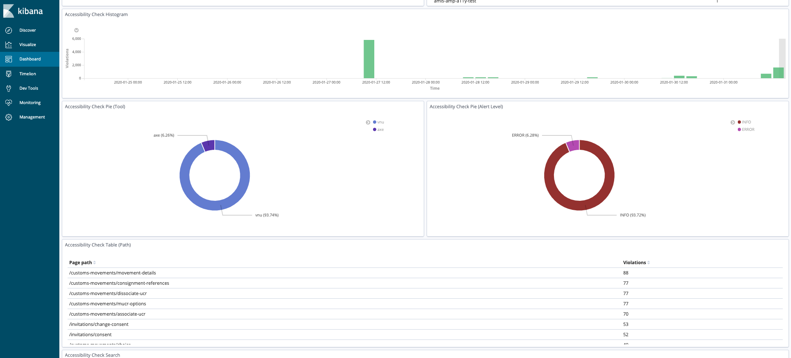

# Stage three: Continuous Integration tools

Once your service has been deployed to staging you’ll want to introduce some automated tests to that service's pipeline. We have the following tooling available for you to make use of in CI.

## `AccessibilityTestJobBuilder`

This job builder captures and archives all HTML pages that your UI tests visit. These pages are then uploaded to a new sidecar container running alongside our Jenkins build slave, named `accessibility-assessment`, and assessed during a post build task. If you currently maintain a UI smoke test that visits each page of your frontend, then running that test suite with this job builder will generate an output for you to review in Kibana (screenshot below).

A link to this dashboard is available in the description of the job in Jenkins.

### The tools are tuned for HMRC Digital front-ends

The tools used in the assessment have been restricted to surface accessibility violations and html validation errors raised on the contents of the `<main>` tag in each HTML page. In addition, it suppresses known violations and errors that we consider unimportant at HMRC, and in some cases, provide further information (links to GitHub issues or design system components) against violations and errors that originate in shared components like the GOV.UK templates.

### Upgrades and improvements do not require action from delivery teams

One of the benefits of implementing this as a component of the build and not as a library that each UI test suite consumes, is the low cost of adopting. Furthermore, as we roll out improvements to the tooling they will be available to everyone making use of the job builder. Features like improved reporting, axe/validator upgrades or even the addition of a new tool will not require effort from delivery teams.
